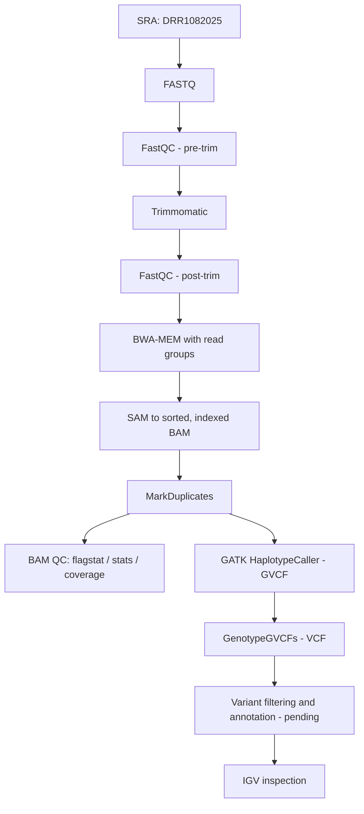

# NGS Read Mapping & Variant Calling (Bacterial Illumina Data)

A reproducible, command-line workflow for bacterial short-read analysis: quality control, trimming, reference-based mapping, BAM processing, GATK variant calling, filtering, and genome-browser inspection.

**Sample:** SRA run `DRR1082025` (*Escherichia coli*, paired-end Illumina) mapped to the *E. coli* str. K-12 substr. MG1655 reference (`NC_000913.3`).

**Status:** In progress. QC, trimming, mapping, and duplicate marking are complete. Haploid variant calling, filtering, and annotation are pending (see [Limitations and next steps](#limitations-and-next-steps)).

---

## Key observations

- **Read quality:** R2 is noticeably worse than R1 (per-base quality FAIL vs WARN), with tile-specific quality problems and technical sequences flagged in the overrepresented-sequences module. Details in [`pre_trim_notes.md`](pre_trim_notes.md).
- **Coverage is high:** mean depth is 60.09x, mean mapping quality is 59, and duplication is very low (0.16%).
- **Mapping rate is lower than expected:** only 74.73% of reads mapped, and 86.04% of the reference has coverage (about 648 kb with zero coverage). For reads from the same strain as the reference, a rate near 98% or higher would be expected. The cause is under investigation (see [Open question](#open-question-low-mapping-rate)).

---

## Workflow



---

## Dataset

| Field | Details |
|---|---|
| SRA run | DRR1082025 |
| Organism | *Escherichia coli* |
| Strain (per run record) | K-12 substr. MG1655 |
| Reference genome | *E. coli* str. K-12 substr. MG1655, `NC_000913.3` |
| Reference size | 4,641,652 bp |
| Platform | Illumina |
| Layout | Paired-end |
| Source | NCBI SRA / DDBJ |

Large files (FASTQ, SAM, BAM, GVCF, VCF) are excluded from the repository. Small QC reports, metrics, and reference index files are kept.

---

## Tools

| Step | Tool |
|---|---|
| Data download | SRA Toolkit |
| Read QC | FastQC |
| Trimming | Trimmomatic |
| Mapping | BWA-MEM |
| BAM processing and QC | SAMtools |
| Duplicate marking, variant calling | GATK (Picard MarkDuplicates, HaplotypeCaller, GenotypeGVCFs) |
| Visualization | IGV |
| Environment | Conda/Mamba, Linux |

Tool versions: _add exact versions here (run `<tool> --version`) and export the environment with `mamba env export --from-history > environment.yml`._

---

## Results

### 1. Raw-read QC (FastQC)

| Metric | R1 | R2 |
|---|---|---|
| Reads | 1,066,446 | 1,066,446 |
| Reported sequence length | 35-301 bp | 35-301 bp |
| Per-base sequence quality | WARN | FAIL |
| Adapter content | PASS | PASS |
| Per-sequence GC content | FAIL | FAIL |
| Approx. GC content | ~50% | ~50% |

The variable read length (35-301 bp) suggests the reads may have been processed before submission. Full interpretation: [`pre_trim_notes.md`](pre_trim_notes.md).

### 2. Trimming

Trimmomatic parameters are listed under [Commands](#commands). Reads surviving as pairs / unpaired: _add from the Trimmomatic log._ Post-trim FastQC findings: _add (per-base quality, overrepresented sequences, adapter content)._

### 3. Mapping and BAM QC

| Metric | Result |
|---|---|
| Total reads (incl. supplementary) | 1,973,026 |
| Primary reads | 1,951,846 |
| Mapped reads | 1,474,518 |
| Mapping rate | 74.73% |
| Primary mapped | 74.46% |
| Properly paired | 73.95% |
| Supplementary alignments | 21,180 |
| Singletons | 4,092 (0.21%) |
| Mean depth | 60.09x |
| Reference covered | 86.04% |
| Zero-coverage bases | 647,951 |
| Mean mapping quality | 59 |
| Mean base quality | 36.9 |

QC files: [`mapping/qc/`](mapping/qc/).

### 4. Duplicate marking (Picard MarkDuplicates)

| Metric | Result |
|---|---|
| Read pairs examined | 724,623 |
| Unpaired reads examined | 4,092 |
| Read-pair duplicates | 681 |
| Unpaired-read duplicates | 1,020 |
| Optical duplicates | 0 |
| Percent duplication | 0.1639% |

Full metrics: [`mapping/DRR1082025.duplicate_metrics.txt`](mapping/DRR1082025.duplicate_metrics.txt). The flagstat numbers above were generated from the sorted BAM before duplicate marking, so they report 0 duplicates; the Picard metrics are the authoritative duplication figures.

### 5. Variants

_Pending._ Planned reporting: raw and filtered SNP/indel counts, Ts/Tv ratio, filter thresholds, and annotated effects.

---

## Open question: low mapping rate

A 74.73% mapping rate with 86% reference coverage is unexpected for reads from the same strain as the reference. Hypotheses to test:

1. The sample is a different *E. coli* strain (or a K-12 derivative with large deletions or insertions) than the metadata indicates.
2. The sample is mixed or contaminated (consistent with the GC-distribution FAIL).
3. The run metadata is mislabeled.

Planned checks:

- Confirm organism, strain, and library details in the DDBJ/ENA run record.
- Extract unmapped reads (`samtools fastq -f 4`), assemble (SPAdes or MEGAHIT), and BLAST the largest contigs, or classify with Kraken2.
- Intersect zero-coverage regions with the MG1655 annotation (`bedtools genomecov -bga`) to see whether they correspond to prophages or IS elements.

Findings will be added here.

---

## Commands

Paths are relative to the project root. Create output directories first (`mkdir -p raw_data trimmed_data qc_reports/pre_trim qc_reports/post_trim mapping/qc variants reference`).

### 1. Download data and reference

```bash
prefetch DRR1082025
fasterq-dump --split-files -O raw_data DRR1082025
gzip raw_data/DRR1082025_*.fastq

# Reference (Entrez Direct)
efetch -db nuccore -id NC_000913.3 -format fasta > reference/reference.fasta
```

### 2. FastQC (pre-trim)

```bash
fastqc -o qc_reports/pre_trim \
  raw_data/DRR1082025_1.fastq.gz raw_data/DRR1082025_2.fastq.gz
```

### 3. Trimmomatic

```bash
trimmomatic PE -threads 4 \
  raw_data/DRR1082025_1.fastq.gz \
  raw_data/DRR1082025_2.fastq.gz \
  trimmed_data/DRR1082025_1_paired.fastq.gz \
  trimmed_data/DRR1082025_1_unpaired.fastq.gz \
  trimmed_data/DRR1082025_2_paired.fastq.gz \
  trimmed_data/DRR1082025_2_unpaired.fastq.gz \
  ILLUMINACLIP:TruSeq3-PE.fa:2:30:10 \
  LEADING:3 TRAILING:3 SLIDINGWINDOW:4:20 MINLEN:36
```

### 4. FastQC (post-trim)

```bash
fastqc -o qc_reports/post_trim \
  trimmed_data/DRR1082025_1_paired.fastq.gz \
  trimmed_data/DRR1082025_2_paired.fastq.gz
```

### 5. Reference indexing

```bash
bwa index reference/reference.fasta
samtools faidx reference/reference.fasta
gatk CreateSequenceDictionary -R reference/reference.fasta
```

### 6. Mapping with read groups

```bash
bwa mem -t 4 \
  -R '@RG\tID:DRR1082025\tSM:DRR1082025\tLB:Lib1\tPL:ILLUMINA\tPU:DRR1082025' \
  reference/reference.fasta \
  trimmed_data/DRR1082025_1_paired.fastq.gz \
  trimmed_data/DRR1082025_2_paired.fastq.gz \
  > mapping/DRR1082025.sam
```

### 7. SAM to sorted, indexed BAM

```bash
samtools view -@ 4 -b mapping/DRR1082025.sam > mapping/DRR1082025.bam
samtools sort -@ 4 -o mapping/DRR1082025.sorted.bam mapping/DRR1082025.bam
samtools index mapping/DRR1082025.sorted.bam
```

### 8. Mark duplicates

```bash
gatk MarkDuplicates \
  -I mapping/DRR1082025.sorted.bam \
  -O mapping/DRR1082025.markdup.bam \
  -M mapping/DRR1082025.duplicate_metrics.txt

samtools index mapping/DRR1082025.markdup.bam
```

### 9. BAM QC

```bash
samtools flagstat mapping/DRR1082025.markdup.bam > mapping/qc/DRR1082025.flagstat.txt
samtools stats    mapping/DRR1082025.markdup.bam > mapping/qc/DRR1082025.stats.txt
samtools idxstats mapping/DRR1082025.markdup.bam > mapping/qc/idxstats.txt
samtools coverage mapping/DRR1082025.markdup.bam > mapping/qc/coverage.txt
```

### 10. Variant calling (GATK)

```bash
gatk HaplotypeCaller \
  -R reference/reference.fasta \
  -I mapping/DRR1082025.markdup.bam \
  -O variants/DRR1082025.g.vcf.gz \
  -ERC GVCF

gatk GenotypeGVCFs \
  -R reference/reference.fasta \
  -V variants/DRR1082025.g.vcf.gz \
  -O variants/DRR1082025.vcf.gz
```

> **Note:** bacteria are haploid. The first run used GATK's default (diploid) ploidy; the re-run adds `-ploidy 1` to both commands (see next steps).

### 11. Inspect in IGV

Load together: `reference/reference.fasta`, `mapping/DRR1082025.markdup.bam` (with its `.bai`), and `variants/DRR1082025.vcf.gz`. Check read pileups, mismatches, mapping quality, strand balance, and SNP/indel calls.

---

## Repository structure

```
ngs-project/
├── mapping/
│   ├── DRR1082025.duplicate_metrics.txt
│   └── qc/                 # flagstat, stats, idxstats, coverage, zero-coverage regions
├── qc_reports/
│   ├── pre_trim/
│   └── post_trim/
├── reference/              # reference.fasta, .fai, .dict
├── variants/               # indexes now; filtered VCF to be added
├── pre_trim_notes.md       # interpretation of raw-read FastQC
├── .gitignore
└── README.md
```

---

## Limitations and next steps

- [ ] Resolve the low mapping rate (see [Open question](#open-question-low-mapping-rate)).
- [ ] Re-run variant calling with `-ploidy 1` in both `HaplotypeCaller` and `GenotypeGVCFs`.
- [ ] Apply hard filters (`gatk VariantFiltration`), document thresholds, and report SNP/indel counts and Ts/Tv (`bcftools stats`).
- [ ] Annotate variants (e.g. SnpEff) and add an IGV screenshot of a representative variant.
- [ ] Cross-check calls with a second caller (bcftools or Snippy) and report concordance.
- [ ] Add `environment.yml` and a Snakemake workflow for one-command reproduction.
- [ ] Commit the small filtered VCF.

---

## Author

Musaddique Mubin Nabil
Microbiology | Bioinformatics | Computational Genomics# NGS Read Mapping & Variant Calling

A practical bacterial NGS bioinformatics project using Illumina sequencing data to perform quality control, read trimming, reference-based read mapping, BAM processing, GATK variant calling, variant QC/filtering, and genome-browser visualization.

## Workflow

```text
SRA
 ↓
FASTQ
 ↓
FastQC → Trimmomatic → FastQC
 ↓
BWA-MEM
 ↓
SAM → BAM → sorted BAM
 ↓
Read Groups → MarkDuplicates → BAM QC
 ↓
Reference indexing (.fai + .dict)
 ↓
GATK HaplotypeCaller
 ↓
GVCF → GenotypeGVCFs → VCF
 ↓
Variant QC / Filtering
 ↓
IGV visualization
```

## Dataset

| Field | Details |
|---|---|
| SRA dataset | **DRR1082025** |
| Organism | *Escherichia coli* |
| Strain / substrain | **K-12 substr. MG1655** |
| Reference genome | **NC_000913.3** |
| Reference size | **4,641,652 bp** |
| Sequencing platform | Illumina |
| Read layout | Paired-end |
| Data source | NCBI SRA |

The reference accession **NC_000913.3** is the complete genome of *Escherichia coli* str. K-12 substr. MG1655. citeturn0search0turn0search7

> **Organism naming correction:** use **“*Escherichia coli* str. K-12 substr. MG1655”** rather than only “*E. coli* K-12” when documenting the reference genome. This makes the strain/substrain information explicit.

Large FASTQ, SAM, BAM, GVCF, and VCF data files are excluded from the repository where appropriate; small QC/index files and reports are retained.

## Results

### 1. Raw-read QC

| Metric | R1 | R2 |
|---|---:|---:|
| Reads | 1,066,446 | 1,066,446 |
| Reported sequence length | 35–301 bp | 35–301 bp |
| Per-base sequence quality | WARN | FAIL |
| Adapter Content | PASS | PASS |
| Per-sequence GC Content | FAIL | FAIL |
| Approx. GC content | ~50% | ~50% |

The raw reads showed the main QC issues documented in `pre_trim_notes.md`: poorer per-base quality in R2, localized tile-specific quality problems, GC-distribution warnings, and overrepresented technical sequences.

### 2. Mapping and BAM QC

| Metric | Result |
|---|---:|
| Total reads | 1,973,026 |
| Primary reads | 1,951,846 |
| Mapped reads | 1,474,518 |
| Mapping rate | **74.73%** |
| Primary mapped | **74.46%** |
| Properly paired | **73.95%** |
| Secondary alignments | 0 |
| Supplementary alignments | 21,180 |
| Singletons | 4,092 (0.21%) |
| Duplicate reads after MarkDuplicates | 0 |
| Mean depth | **60.09×** |
| Reference covered | **86.04%** |
| Mean mapping quality | 59 |
| Mean base quality | 36.9 |
| Zero-coverage bases | 647,951 |

The mapping QC files in the repository record the above values. The reference sequence is NC_000913.3.

### 3. Duplicate-marking metrics

Picard/GATK MarkDuplicates reported:

| Metric | Result |
|---|---:|
| Read pairs examined | 724,623 |
| Unpaired reads examined | 4,092 |
| Read-pair duplicates | 681 |
| Unpaired read duplicates | 1,020 |
| Optical duplicates | 0 |
| Percent duplication | **0.1639%** |
| Estimated library size | 385,278,606 |

Note that the `flagstat` result reports **0 duplicates** because duplicate marking was performed on the processed BAM used for that QC snapshot; the separate MarkDuplicates metrics file records the duplicate reads identified by Picard. The two files therefore should not be interpreted as identical measurements.

## Commands

The following commands document the command-line workflow used for this project. File names can be adjusted to match the local working directory.

### 1. FastQC — pre-trimming

```bash
fastqc -o qc_reports/pre_trim raw_data/DRR1082025_1.fastq.gz raw_data/DRR1082025_2.fastq.gz
```

### 2. Trimmomatic — paired-end trimming

```trimmomatic PE -threads 4 \
  raw_data/DRR1082025_1.fastq.gz \
  raw_data/DRR1082025_2.fastq.gz \
  trimmed_data/DRR1082025_1_paired.fastq.gz \
  trimmed_data/DRR1082025_1_unpaired.fastq.gz \
  trimmed_data/DRR1082025_2_paired.fastq.gz \
  trimmed_data/DRR1082025_2_unpaired.fastq.gz \
  ILLUMINACLIP:TruSeq3-PE.fa:2:30:10 \
  LEADING:3 TRAILING:3 SLIDINGWINDOW:4:20 MINLEN:36
```

### 3. FastQC — post-trimming

```fastqc -o qc_reports/post_trim \
  trimmed_data/DRR1082025_1_paired.fastq.gz \
  trimmed_data/DRR1082025_2_paired.fastq.gz
```

### 4. BWA reference indexing

```bash
bwa index reference/reference.fasta
```

### 5. BWA-MEM read mapping with read groups

```bash
bwa mem -t 4 \
  -R '@RG\tID:DRR1082025\tSM:DRR1082025\tLB:Lib1\tPL:ILLUMINA\tPU:DRR1082025' \
  reference/reference.fasta \
  trimmed_data/DRR1082025_1_paired.fastq.gz \
  trimmed_data/DRR1082025_2_paired.fastq.gz \
  > mapping/DRR1082025.sam
```

### 6. SAM → BAM → sorted BAM

```bash
samtools view -@ 4 -b mapping/DRR1082025.sam > mapping/DRR1082025.bam

samtools sort -@ 4 \
  -o mapping/DRR1082025.sorted.bam \
  mapping/DRR1082025.bam

samtools index mapping/DRR1082025.sorted.bam
```

### 7. Reference indexes required by GATK

```bash
samtools faidx reference/reference.fasta

gatk CreateSequenceDictionary \
  -R reference/reference.fasta
```

This produces:

```text
reference.fasta
reference.fasta.fai
reference.dict
```

### 8. BAM QC

```bash
samtools flagstat mapping/DRR1082025.sorted.bam

samtools stats mapping/DRR1082025.sorted.bam \
  > mapping/qc/DRR1082025.stats.txt

samtools idxstats mapping/DRR1082025.sorted.bam \
  > mapping/qc/idxstats.txt

samtools coverage mapping/DRR1082025.sorted.bam \
  > mapping/qc/coverage.txt
```

### 9. Mark duplicates

```gatk MarkDuplicates \
  -I mapping/DRR1082025.rg.bam \
  -O mapping/DRR1082025.markdup.bam \
  -M mapping/DRR1082025.duplicate_metrics.txt
```

Then index the resulting BAM:

```bash
samtools index mapping/DRR1082025.markdup.bam
```

### 10. GATK HaplotypeCaller

```bash
gatk HaplotypeCaller \
  -R reference/reference.fasta \
  -I mapping/DRR1082025.markdup.bam \
  -O variants/DRR1082025.g.vcf.gz \
  -ERC GVCF
```

### 11. GenotypeGVCFs

```bash
gatk GenotypeGVCFs \
  -R reference/reference.fasta \
  -V variants/DRR1082025.g.vcf.gz \
  -O variants/DRR1082025.vcf.gz
```

### 12. IGV visualization

Load the following together in IGV:

```text
reference/reference.fasta
mapping/DRR1082025.markdup.bam
mapping/DRR1082025.markdup.bam.bai
variants/DRR1082025.vcf.gz
```

Inspect read pileups, coverage, mismatches, mapping quality, strand distribution, SNPs, and indels.

## Repository Structure

```text
ngs-project/
├── mapping/
│   ├── DRR1082025.duplicate_metrics.txt
│   └── qc/
│       ├── DRR1082025.flagstat.txt
│       ├── DRR1082025.mapping_QC.txt
│       ├── DRR1082025.stats.txt
│       ├── DRR1082025.zero_coverage_regions.txt
│       ├── coverage.txt
│       └── idxstats.txt
├── qc_reports/
│   ├── pre_trim/
│   └── post_trim/
├── reference/
│   ├── reference.fasta
│   ├── reference.fasta.fai
│   └── reference.dict
├── variants/
│   ├── DRR1082025.g.vcf.gz.tbi
│   └── DRR1082025.vcf.gz.tbi
├── pre_trim_notes.md
├── .gitignore
└── README.md
```

## Learning Goals

* NGS quality control
* Read trimming
* Reference-based mapping
* SAM/BAM processing
* Read groups
* Duplicate marking
* GATK reference preparation
* GATK HaplotypeCaller
* GVCF and VCF analysis
* Variant filtering
* IGV visualization
* Reproducible command-line bioinformatics

## Status

**Learning / Portfolio Project**

Built to develop practical skills in bacterial NGS analysis and computational genomics.

## Author

**Musaddique Mubin Nabil**

Microbiology | Bioinformatics | Computational Genomics

